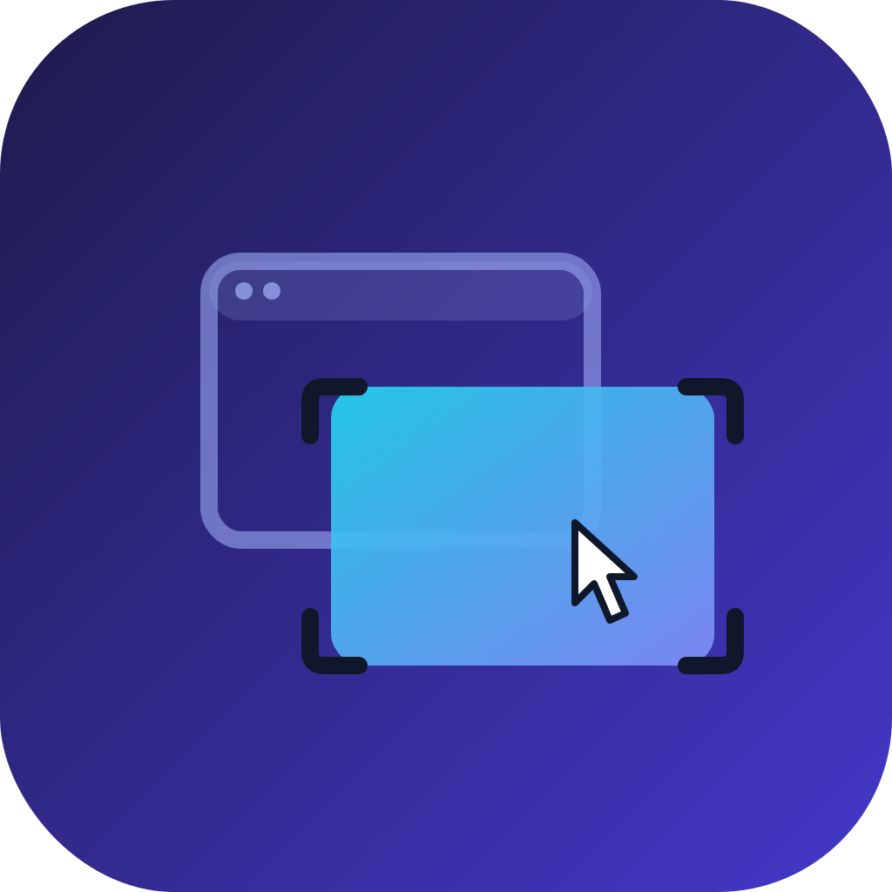

# Overlay Viewer

<p align="center">
  
</p>

A lightweight macOS menu-bar utility that pins any image as a floating overlay above every window on your screen — across all Spaces, on every monitor, and even over fullscreen apps.

Useful for referencing a design mockup while coding, keeping a reference image visible while drawing or modeling, or comparing an asset against live work without alt-tabbing.

---

## Features

- **Always on top** — the overlay floats above every other application window, including fullscreen apps
- **Follows you everywhere** — stays visible across all Spaces and all connected monitors
- **Adjustable opacity** — fade the image to see what's underneath without moving it
- **Custom window size** — set an exact pixel width and height via the gear icon in the toolbar; the setting persists across relaunches
- **Reset to fit** — one click snaps the window back to the auto-fitted image size
- **Drag and drop** — drop an image file directly onto the welcome screen to open it
- **Connect Figma (OAuth2)** — sign in with your Figma account to overlay frames from **private** files, not just public ones
- **Persistent state** — remembers the last opened image, your opacity level, and any custom window size
- **No Dock icon** — lives entirely in the menu bar; stays out of your way

---

## How to Use

### Opening an image
1. Click the **photo icon** in the menu bar
2. Choose **Open Image…**, or press **Cmd+O** from anywhere
3. Alternatively, drag an image file onto the welcome screen

### Connecting Figma
The welcome screen has a **Connect Figma** button above the URL field.

1. Click **Connect Figma**. This opens Figma's consent screen in a system-mediated
   browser session (`ASWebAuthenticationSession`) — never an embedded webview, since
   Figma blocks those.
2. Approve access. The button area swaps to **Connected as `<your handle>` · Disconnect**.
3. Paste a `figma.com/file/...` or `figma.com/design/...` URL (optionally with a
   `?node-id=` for a specific frame) and click **Open**. The app fetches a real
   rendered image of that file/frame using your OAuth token and shows it like any
   other overlay image — including files only your account has access to.

Click **Disconnect** to revoke local access (this clears the stored tokens; it does
not affect grants on Figma's side).

If you see "You don't have access to that Figma file," the connected Figma account
genuinely doesn't have permission to that file — connect with the account that does.

### Toolbar ribbon
Once an image is loaded, a thin toolbar appears at the top of the overlay:

| Button | Action |
|---|---|
| ✕ | Hide the overlay (does not remove the image) |
| Change… | Open a new image in place of the current one |
| Remove | Clear the image and return to the welcome screen |
| ⚙ | Open the size settings popover |
| Opacity slider | Fade the image content (0.1 → fully transparent, 1.0 → fully opaque) |

### Custom size
Click the **gear icon** (⚙) to open the size popover:
- Enter a **Width** and **Height** in pixels and press **Apply** — the window resizes immediately and the values are saved
- Press **Reset** to clear the saved size and snap the window back to the auto-fitted image dimensions
- Values below 400 × 96 px are clamped to the minimum window size

### Keyboard shortcuts
| Shortcut | Action |
|---|---|
| `Escape` | Hide the overlay |
| `Cmd+O` | Open image picker |

### Menu bar
Right-click (or click) the menu bar icon for quick access to:
- **Open Image…**
- **Toggle Visibility** — show or hide the overlay without closing it
- **Quit**

---

## Requirements

- macOS 26.5 or later
- No external dependencies (Figma OAuth uses only system frameworks: `AuthenticationServices`, `CryptoKit`, `Security`)

---

## Building

1. Open `overlay-viewer.xcodeproj` in Xcode
2. Select the **overlay-viewer** scheme
3. [Set the Figma OAuth environment variables](#figma-oauth-setup) on that scheme (one-time)
4. Press **Cmd+R** to build and run

No package dependencies, no build scripts — just standard AppKit/SwiftUI.

**One-time setup after cloning:** `brew install swiftlint`, then
`git config core.hooksPath .githooks` — wires in the pre-commit lint gate
(see [Linting](#linting) below). Both are per-clone local settings, not
tracked by git, so every fresh clone needs to run them once.

---

## Linting

[SwiftLint](https://github.com/realm/SwiftLint) runs as a git pre-commit hook
(`.githooks/pre-commit`, wired via `git config core.hooksPath .githooks` —
see Building above). It only checks staged `.swift` files, and only
**error**-severity violations block the commit; warnings are printed but
don't. `.swiftlint.yml` deliberately keeps this to bug-catching rules
(`force_cast`/`force_try` as errors, `force_unwrapping` as a warning) rather
than house style — see the comments in that file for why.

Bypass with `git commit --no-verify` if you genuinely need to (not
recommended). Run `swiftlint lint` directly any time to see the full report.

---

## Figma OAuth Setup

Connecting Figma requires registering an OAuth app at
[figma.com/developers/apps](https://www.figma.com/developers/apps) and giving the
overlay app three values as **environment variables**:

| Variable | What it is |
|---|---|
| `FIGMA_CLIENT_ID` | The OAuth app's client ID, from the Figma developer console |
| `FIGMA_CLIENT_SECRET` | The OAuth app's client secret |
| `FIGMA_REDIRECT_URI` | Must be `overlay-viewer-figma://oauth-callback` |

When registering the app on Figma, set its callback/redirect URL to
`overlay-viewer-figma://oauth-callback` — that custom scheme is already registered
in `Info.plist` (`CFBundleURLTypes`) so macOS routes the redirect back into this app.

**Setting the env vars for local development:** Xcode → Product → Scheme → Edit
Scheme… → Run → Arguments tab → Environment Variables. These only apply to runs
launched *by Xcode*; they are not baked into a distributed build.

There is no backend in this app, so there's nowhere safe to keep a Figma client
secret hidden from the binary — `FigmaOAuthService` embeds it client-side and pairs
it with PKCE (`code_verifier`/`code_challenge`) as the practical mitigation. This is
the standard pattern for installed/desktop OAuth apps; the real security boundary is
the registered redirect URI and PKCE, not secrecy of the client secret. See
`FigmaOAuthService.swift` for the full token-exchange/refresh implementation. The
scope requested is `file_content:read,current_user:read`.

Figma access tokens expire (90 days); `FigmaAPIClient` transparently refreshes via
the stored refresh token on a 401 and retries once. Tokens live in the macOS
Keychain (`FigmaTokenStore.swift`), never in `UserDefaults` or logs.

---

## Project Structure

Source is grouped by role, not by type — everything about one concern lives together:

```
overlay-viewer/
├── App/
│   ├── main.swift                  # Imperative entry point (NSApplication.shared.run())
│   ├── AppDelegate.swift           # Menu bar item, status icon, app lifecycle
│   ├── AppEnvironment.swift        # Composition root: owns/wires the concrete providers
│   └── OverlayViewerApp.swift      # Intentionally-empty SwiftUI template leftover — must stay empty
├── Core/
│   └── DesignSourceProviding.swift # The plugin seam: protocol any design-image source conforms to
├── Features/
│   ├── Overlay/                   # Everything the overlay window owns
│   │   ├── OverlayWindow.swift
│   │   ├── OverlayWindowController.swift
│   │   ├── WelcomeWindowController.swift
│   │   ├── ImageCanvasView.swift
│   │   ├── ResizeHandleView.swift
│   │   └── SizeSettingsViewController.swift
│   └── Figma/                     # The one DesignSourceProviding conformance today
│       ├── FigmaProvider.swift          # Adapts OAuth+API+URLParser to DesignSourceProviding
│       ├── FigmaOAuthService.swift      # OAuth2 + PKCE flow, token exchange/refresh
│       ├── FigmaTokenStore.swift        # Keychain-backed storage for the access/refresh tokens
│       ├── FigmaAPIClient.swift         # Authenticated calls to api.figma.com, 401-retry
│       ├── FigmaURLParser.swift         # Extracts file_key/node-id from a pasted Figma URL
│       └── FigmaConnectView.swift       # Animated Connect/Connected toggle shown on the welcome screen
├── Info.plist                      # Needed for CFBundleURLTypes / OAuth callback scheme
├── overlay-viewer.entitlements
├── Local.xcconfig                  # Optionally pulls FIGMA_CLIENT_ID/SECRET from root .env
└── Assets.xcassets/
```

`overlay-viewer/` is an Xcode "file system synchronized" group, so this layout is exactly
what Finder/`git mv` shows — no extra Xcode bookkeeping needed to reorganize it further.

### How the pieces fit together

```
AppDelegate
  └── AppEnvironment                    (composition root — owns FigmaProvider today)
        └── OverlayWindowController(environment:)
              ├── OverlayWindow          (the floating NSWindow)
              ├── ToolbarRibbonView      (NSVisualEffectView strip at the top)
              │     └── buttons + opacity slider
              ├── ImageCanvasView        (fills the area below the ribbon)
              ├── SizeSettingsViewController  (shown as NSPopover from the gear button)
              └── WelcomeWindowController(environment:)  (shown when no image is loaded)
                    └── WelcomeWindow    (frosted-glass drop target)
```

Window controllers receive `AppEnvironment` through their initializer instead of reaching
for `.shared` singletons directly — `FigmaOAuthService.shared`/`FigmaAPIClient.shared` still
exist as the real defaults `FigmaProvider` wraps, but nothing above the `Features/Figma/`
layer knows they exist.

### Adding a new design source

Figma is the only thing overlay images come from today, but the seam is generic
(`Core/DesignSourceProviding.swift`). To add another one (e.g. Sketch, Zeplin, a plain
URL-image source):

1. Create `Features/<Name>/<Name>Provider.swift` conforming to `DesignSourceProviding`
   (`canHandle(url:)`, `connect()`, `fetchImage(from:)`, `restoreLastImage()`, etc.) — see
   `FigmaProvider.swift` for the reference implementation.
2. Add a property for it to `AppEnvironment` and append it to `providers`.
3. `WelcomeWindowController` currently hardcodes its Figma-specific UI copy/field; a second
   provider would mean generalizing that UI to loop over `environment.providers` and ask each
   `canHandle(url:)` — that generalization hasn't been done yet since there's only one
   provider to drive it.

### Key design decisions

- **Menu-bar only (`.accessory` policy)** — the app has no Dock icon and no main menu. All interaction goes through the status item and the overlay's own toolbar ribbon.
- **`canJoinAllSpaces` + `fullScreenAuxiliary`** — these two `NSWindow.CollectionBehavior` flags are what make the overlay follow the user across desktops and appear over fullscreen Spaces.
- **Separate window-level opacity vs. content opacity** — the window's `alphaValue` is always 1.0; only `ImageCanvasView.alphaValue` is adjusted by the slider. This prevents the toolbar ribbon from fading along with the image.
- **Layer properties deferred to `layout()`** — `NSVisualEffectView` subclasses set `cornerRadius` in `layout()` (not in `init`) to avoid a layout recursion triggered by AppKit's visual-effect layer management during the first Auto Layout pass.
- **Lazy window controller creation** — `OverlayWindowController` is a `lazy var` on `AppDelegate` so the `NSWindow` is not constructed until `applicationDidFinishLaunching`, avoiding issues with early window creation before `NSApp` is fully initialized.
- **Figma content is a fetched image, not a live embed** — private Figma files can't be shown via the old `WKWebView` embed iframe (it had no way to carry an OAuth bearer token, and Figma blocks embedding in webviews anyway). Instead, `FigmaAPIClient` fetches a real rendered PNG of the file/frame using the connected user's token, and it's displayed through the same `ImageCanvasView` as any other image.
- **Providers own their own persistence** — `FigmaProvider` persists its own "last opened resource" (`overlay.lastFigmaFileKey`/`overlay.lastFigmaNodeID`) instead of `OverlayWindowController` knowing Figma has a fileKey/nodeID at all, so the window layer only ever deals in `NSImage`.

---

## Persistence

Non-sensitive state is stored in `UserDefaults` under these keys:

| Key | What it stores |
|---|---|
| `overlay.lastImageURL` | Absolute URL of the last opened local image (absent if the last load was from Figma) |
| `overlay.lastFigmaFileKey` | Figma `file_key` to re-fetch on relaunch (absent if the last load was a local image) |
| `overlay.lastFigmaNodeID` | Optional Figma node ID for that file (a specific frame) |
| `overlay.figmaHandle` | Cached display name shown as "Connected as …" — not a secret, just a label |
| `overlay.opacity` | Opacity slider value (0.1 – 1.0) |
| `overlay.customWidth` | Custom window width in points (absent = auto-fit) |
| `overlay.customHeight` | Custom window height in points (absent = auto-fit) |
| `NSWindow Frame OverlayWindowFrame` | Window position/size managed by AppKit autosave |

The Figma **access token** and **refresh token** are never stored in `UserDefaults`.
They live in the macOS Keychain, written/read only by `FigmaTokenStore.swift`.
