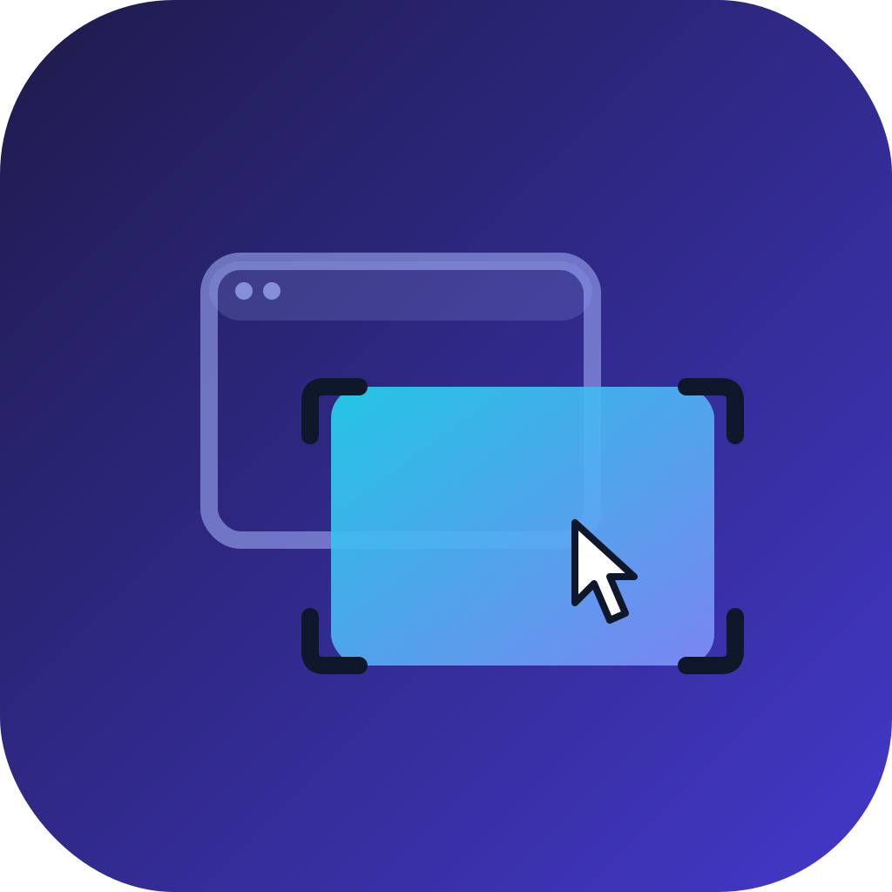

# Overlay Viewer

<p align="center">
  
</p>

A lightweight macOS menu-bar utility that pins any image as a floating overlay above every window on your screen — across all Spaces, on every monitor, and even over fullscreen apps.

Useful for referencing a design mockup while coding, keeping a reference image visible while drawing or modeling, or comparing an asset against live work without alt-tabbing.

---

## Features

- **Always on top** — the overlay floats above every other application window, including fullscreen apps
- **Follows you everywhere** — stays visible across all Spaces and all connected monitors
- **Adjustable opacity** — fade the image content live; the window border, toolbar, and calibration grid stay fully visible so the overlay never reads as "gone"
- **Calibration dot-grid** — a faint fixed-alpha grid sits behind the image as a stable reference while you scrub opacity
- **Native window controls** — real macOS traffic lights; the close button quits the app
- **Custom window size** — set an exact pixel width and height from the gear in the toolbar, or drag the edges down to a small thumbnail; the setting persists across relaunches
- **Reset to fit** — one click snaps the window back to the auto-fitted image size
- **Drag, browse, or Figma** — three co-equal ways in on the start screen: drop an image, click to browse, or paste a Figma URL
- **Connect Figma (OAuth2)** — sign in with your Figma account to overlay frames from **private** files, not just public ones
- **Persistent state** — remembers the last opened image, your opacity level, and any custom window size
- **No Dock icon** — lives entirely in the menu bar; stays out of your way

---

## How to Use

### Opening an image
1. Click the **photo icon** in the menu bar and choose **Open Image…**, or press **Cmd+O** from anywhere
2. Or drag an image file onto the start screen
3. Or click anywhere on the "Drag an image here" card to browse

### Connecting Figma
The start screen shows a **Figma** card with a **Connect Figma** button (when Figma is configured — see [Figma OAuth Setup](#figma-oauth-setup)).

1. Click **Connect Figma**. This opens Figma's consent screen in a system-mediated
   browser session (`ASWebAuthenticationSession`) — never an embedded webview, since
   Figma blocks those.
2. Approve access. The card shows **Connected as `<your handle>`** (with an icon, so
   the state reads without relying on color) and reveals a URL field.
3. Paste a `figma.com/file/...` or `figma.com/design/...` URL (optionally with a
   `?node-id=` for a specific frame) and click **Open**. The app fetches a real
   rendered image of that file/frame using your OAuth token and shows it like any
   other overlay image — including files only your account has access to.

Click **Disconnect** to revoke local access (this clears the stored tokens; it does
not affect grants on Figma's side).

### Toolbar
Once an image is loaded, a thin toolbar appears at the top of the overlay:

| Control | Action |
|---|---|
| 🔴 Red traffic light (or `Cmd+W`) | Close the window and **quit the app** |
| **Clear** (🗑) | Remove the image and return to the start screen |
| **⚙ Gear** | Open the custom size popover |
| **Opacity** slider + live `%` | Fade only the image content (10% → faint, 100% → opaque) |

The toolbar controls collapse gracefully as the window narrows (the label drops to an icon, the opacity module shrinks) so the overlay stays usable when shrunk small.

### Custom size
Click the **gear** (⚙) to open the size popover:
- Enter a **Width** and **Height** in pixels and press **Apply** — the window resizes immediately and the values are saved
- Press **Reset to Fit** to clear the saved size and snap the window back to the auto-fitted image dimensions
- You can also just drag the window edges; sizes are clamped to the window minimum

### Closing vs. hiding — two different intents
- **Close** (the window's red traffic light, or `Cmd+W`) means "I'm done" → the app **fully quits**. Relaunch it from Spotlight/Finder/Dock next time.
- **Toggle Visibility** (menu bar, `Cmd+H`) means "get it out of my way for a moment" → the overlay **hides but keeps running**.
- **Escape** also hides the overlay without quitting.

### Keyboard shortcuts
| Shortcut | Action |
|---|---|
| `Cmd+O` | Open image picker |
| `Escape` | Hide the overlay (keeps running) |
| `Cmd+W` | Close the window → quit the app |
| `Cmd+H` | Toggle Visibility (hide/show without quitting) |
| `Cmd+Q` | Quit |

### Menu bar
Click the menu bar icon for quick access to:
- **Open Image…**
- **Toggle Visibility** — show or hide the overlay without quitting
- **Quit**

---

## Requirements

- macOS 26.5 or later
- No external dependencies (Figma OAuth uses only system frameworks: `AuthenticationServices`, `CryptoKit`, `Security`)
- For releasing: optional `gh` (GitHub CLI) and `create-dmg` (Homebrew)

---

## Building

1. Open `overlay-viewer.xcodeproj` in Xcode
2. Select the **overlay-viewer** scheme
3. (Optional, for Figma) copy `.env.example` to `.env` and fill in your Figma OAuth
   values — see [Figma OAuth Setup](#figma-oauth-setup). Without them the app runs
   fine; the Figma card is simply hidden.
4. Press **Cmd+R** to build and run

No package dependencies — just standard AppKit + SwiftUI (a hybrid: an AppKit window/overlay shell hosting SwiftUI views via `NSHostingView`, backed by view models).

**One-time setup after cloning:** `brew install swiftlint`, then
`git config core.hooksPath .githooks` — wires in the pre-commit lint gate
(see [Linting](#linting) below). Both are per-clone local settings, not
tracked by git, so every fresh clone needs to run them once.

---

## Distribution (Releasing)

The app is distributed **outside the App Store** as an ad-hoc-signed `.dmg` published to
GitHub Releases — no paid Apple Developer account required. The whole process is scripted:

```bash
./release.sh            # build + ad-hoc sign + package build/overlay-viewer-<version>.dmg
./release.sh --publish  # the above, then tag vX.Y.Z and create the GitHub release
```

Because the build is not notarized, downloaders do a one-time Gatekeeper bypass on first
launch (right-click ▸ Open). See **[RELEASE.md](RELEASE.md)** for the full process and
**[CHANGELOG.md](CHANGELOG.md)** for the release notes / tester instructions.

> **Note:** for release builds, `release.sh` bakes the Figma credentials into the app's
> `Info.plist` (see below), which embeds the client secret in the shipped app. Only do
> this for trusted test builds, and rotate the secret afterward.

---

## Linting

[SwiftLint](https://github.com/realm/SwiftLint) runs as a git pre-commit hook
(`.githooks/pre-commit`, wired via `git config core.hooksPath .githooks` —
see Building above). It only checks staged `.swift` files, and only
**error**-severity violations block the commit; warnings are printed but
don't. `.swiftlint.yml` deliberately keeps this to bug-catching rules
(`force_cast`/`force_try` as errors, `force_unwrapping` as a warning) rather
than house style — see the comments in that file for why.

Bypass with `git commit --no-verify` if you genuinely need to (not
recommended). Run `swiftlint lint` directly any time to see the full report.

---

## Figma OAuth Setup

Connecting Figma requires registering an OAuth app at
[figma.com/developers/apps](https://www.figma.com/developers/apps) and giving the
overlay app three values:

| Value | What it is |
|---|---|
| `FIGMA_CLIENT_ID` | The OAuth app's client ID, from the Figma developer console |
| `FIGMA_CLIENT_SECRET` | The OAuth app's client secret |
| `FIGMA_REDIRECT_URI` | Must be `overlay-viewer-figma://oauth-callback` |

When registering the app on Figma, set its callback/redirect URL to
`overlay-viewer-figma://oauth-callback` — that custom scheme is already registered
in `Info.plist` (`CFBundleURLTypes`) so macOS routes the redirect back into this app.

**Where the app reads these from** (`FigmaOAuthConfiguration.resolved`):

- **Local development** — from the process environment. Put the three values in a
  `.env` at the repo root (copy `.env.example`); `Local.xcconfig` includes it, and the
  scheme passes them to Xcode-launched runs. Missing `.env` → Figma just stays hidden.
- **Distributed builds** — a shipped `.app` has no process environment, so `release.sh`
  bakes the same three values into `Info.plist` (`FigmaClientID` / `FigmaClientSecret` /
  `FigmaRedirectURI`) at package time. The app falls back to reading them from the bundle.

There is no backend in this app, so there's nowhere safe to keep the Figma client
secret hidden from the binary — `FigmaOAuthService` pairs it with PKCE
(`code_verifier`/`code_challenge`) as the practical mitigation. This is the standard
pattern for installed/desktop OAuth apps; the real security boundary is the registered
redirect URI and PKCE, not secrecy of the client secret. The scope requested is
`file_content:read,current_user:read`.

Figma access tokens expire (90 days); `FigmaAPIClient` transparently refreshes via
the stored refresh token on a 401 and retries once. Tokens live in the macOS
Keychain (`FigmaTokenStore.swift`), never in `UserDefaults` or logs.

---

## Project Structure

Source is grouped by role, not by type — everything about one concern lives together:

```
overlay-viewer/
├── App/
│   ├── main.swift                  # Imperative entry point (NSApplication.shared.run())
│   ├── AppDelegate.swift           # Menu bar item, status icon, app lifecycle, Quit
│   ├── AppEnvironment.swift        # Composition root: owns/wires the concrete providers
│   └── OverlayViewerApp.swift      # Intentionally-empty SwiftUI template leftover — must stay empty
├── Core/
│   ├── DesignSourceProviding.swift # The plugin seam: protocol any design-image source conforms to
│   ├── FigmaConnectionState.swift  # UI-agnostic connection state (icon + text, never color alone)
│   ├── DesignTokens.swift          # One accent hue, spacing, radii for the SwiftUI layer
│   └── VisualEffectView.swift      # Reusable SwiftUI ↔ NSVisualEffectView vibrancy bridge
├── Features/
│   ├── Overlay/                    # Everything the overlay window owns
│   │   ├── OverlayWindow.swift               # Always-on-top, titled-transparent NSWindow
│   │   ├── OverlayWindowController.swift      # Wires the container: grid + canvas + toolbar
│   │   ├── OverlayControlsViewModel.swift     # Opacity + custom-size intents (source of truth)
│   │   ├── OverlayToolbar.swift               # Single reusable SwiftUI toolbar (material, clusters, size popover)
│   │   ├── CanvasGridView.swift               # Fixed-alpha dot-grid calibration layer
│   │   ├── ImageCanvasView.swift              # Draws the image at contentOpacity
│   │   ├── ResizeHandleView.swift             # Edge/corner drag-to-resize overlay
│   │   └── WelcomeWindowController.swift       # Hosts the start screen; owns the file picker
│   ├── Welcome/
│   │   ├── WelcomeViewModel.swift             # Start-screen state + Figma connect intents
│   │   └── WelcomeView.swift                  # SwiftUI start screen (drag / browse / Figma)
│   └── Figma/                     # The one DesignSourceProviding conformance today
│       ├── FigmaProvider.swift          # Adapts OAuth+API+URLParser to DesignSourceProviding
│       ├── FigmaOAuthService.swift      # OAuth2 + PKCE flow, token exchange/refresh, config resolution
│       ├── FigmaTokenStore.swift        # Keychain-backed storage for the access/refresh tokens
│       ├── FigmaAPIClient.swift         # Authenticated calls to api.figma.com, 401-retry
│       └── FigmaURLParser.swift         # Extracts file_key/node-id from a pasted Figma URL
├── Info.plist                      # CFBundleURLTypes / OAuth callback scheme; Figma creds baked in at release
├── overlay-viewer.entitlements
├── Local.xcconfig                  # Optionally pulls FIGMA_* from root .env
└── Assets.xcassets/
```

`overlay-viewer/` is an Xcode "file system synchronized" group, so this layout is exactly
what Finder/`git mv` shows. (The **test** target is a traditional group — new test files
must be added to it in `project.pbxproj`.)

### How the pieces fit together

```
AppDelegate
  └── AppEnvironment                         (composition root — owns FigmaProvider today)
        └── OverlayWindowController(environment:)
              ├── OverlayWindow               (the floating, titled-transparent NSWindow)
              ├── CanvasGridView              (fixed-alpha calibration grid, behind the image)
              ├── ImageCanvasView             (draws the image at contentOpacity)
              ├── OverlayToolbar (SwiftUI)    (hosted via NSHostingView)
              │     ├── OverlayControlsViewModel   (opacity + size intents)
              │     └── size-settings popover      (SwiftUI, in the toolbar component)
              ├── ResizeHandleView            (edge/corner resize)
              └── WelcomeWindowController(environment:)   (shown when no image is loaded)
                    ├── WelcomeWindow          (frosted-glass, titled-transparent)
                    └── WelcomeView (SwiftUI)  (hosted via NSHostingView)
                          └── WelcomeViewModel  (depends on DesignSourceProviding)
```

Window controllers receive `AppEnvironment` through their initializer instead of reaching
for `.shared` singletons directly. The SwiftUI views are dumb renderers over their view
models; the view models own behavior and talk to the outside world only through the
`DesignSourceProviding` seam, which makes them unit-testable with a mock source (no real
network or browser).

### Adding a new design source

Figma is the only thing overlay images come from today, but the seam is generic
(`Core/DesignSourceProviding.swift`). To add another one (e.g. Sketch, Zeplin, a plain
URL-image source):

1. Create `Features/<Name>/<Name>Provider.swift` conforming to `DesignSourceProviding`
   (`canHandle(url:)`, `connect()`, `fetchImage(from:)`, `restoreLastImage()`, etc.) — see
   `FigmaProvider.swift` for the reference implementation.
2. Add a property for it to `AppEnvironment` and append it to `providers`.
3. `WelcomeView` currently shows Figma-specific UI; a second provider would mean
   generalizing that to loop over `environment.providers` — not done yet since there's
   only one provider to drive it.

### Key design decisions

- **Menu-bar only (`.accessory` policy)** — no Dock icon. Interaction goes through the status item and the overlay's own toolbar.
- **Hybrid AppKit + SwiftUI** — AppKit owns the hand-tuned always-on-top, borderless-feeling, drag-anywhere windows and the `ASWebAuthenticationSession` anchoring; SwiftUI (via `NSHostingView`) owns the start screen and toolbar, driven by view models. Hosted SwiftUI uses `.ignoresSafeArea()` because the titled + full-size-content window would otherwise inset it under the (invisible) title bar.
- **Native traffic lights on a borderless-*feeling* window** — both windows are `.titled` with `titlebarAppearsTransparent` + `.fullSizeContentView`, so the system draws real traffic lights (with built-in hover, `Cmd+W`, and VoiceOver) while the content still fills the frame. Minimize/zoom are hidden.
- **Close means quit** — `windowShouldClose` on both window controllers calls `NSApplication.shared.terminate(nil)`. `Toggle Visibility` and `Escape` use `orderOut`/`orderFront` instead, so they hide without quitting — two intents, two code paths.
- **Opacity is scoped to the image only** — the slider drives `ImageCanvasView.contentOpacity` (a `draw(fraction:)` fade of the pixels), never `window.alphaValue`. The window, its border, the toolbar, and the calibration grid all stay fully visible at any opacity.
- **Calibration dot-grid** — `CanvasGridView` draws a fixed low-alpha grid (plus a faint neutral panel) behind the image, at a constant alpha never tied to the opacity value, so a faded overlay never reads as "broken."
- **`canJoinAllSpaces` + `fullScreenAuxiliary`** — these `NSWindow.CollectionBehavior` flags make the overlay follow the user across desktops and appear over fullscreen Spaces.
- **Single, reusable toolbar component** — `OverlayToolbar` carries its own vibrant material (via `VisualEffectView`), height, divider, and size-settings popover, so it drops in with one `NSHostingView` line and no AppKit wrapper.
- **Providers own their own persistence** — `FigmaProvider` persists its own "last opened resource" (`overlay.lastFigmaFileKey`/`overlay.lastFigmaNodeID`) so the window layer only ever deals in `NSImage`.
- **Figma content is a fetched image, not a live embed** — private Figma files can't be shown via a `WKWebView` iframe (no way to carry an OAuth bearer token, and Figma blocks webview embedding). `FigmaAPIClient` fetches a real rendered PNG using the connected user's token, displayed through the same `ImageCanvasView` as any other image.

---

## Persistence

Non-sensitive state is stored in `UserDefaults` under these keys:

| Key | What it stores |
|---|---|
| `overlay.lastImageURL` | Absolute URL of the last opened local image (absent if the last load was from Figma) |
| `overlay.lastFigmaFileKey` | Figma `file_key` to re-fetch on relaunch (absent if the last load was a local image) |
| `overlay.lastFigmaNodeID` | Optional Figma node ID for that file (a specific frame) |
| `overlay.figmaHandle` | Cached display name shown as "Connected as …" — not a secret, just a label |
| `overlay.opacity` | Opacity value (0.1 – 1.0) |
| `overlay.customWidth` | Custom window width in points (absent = auto-fit) |
| `overlay.customHeight` | Custom window height in points (absent = auto-fit) |
| `NSWindow Frame OverlayWindowFrame` | Window position/size managed by AppKit autosave |

The Figma **access token** and **refresh token** are never stored in `UserDefaults`.
They live in the macOS Keychain, written/read only by `FigmaTokenStore.swift`.
